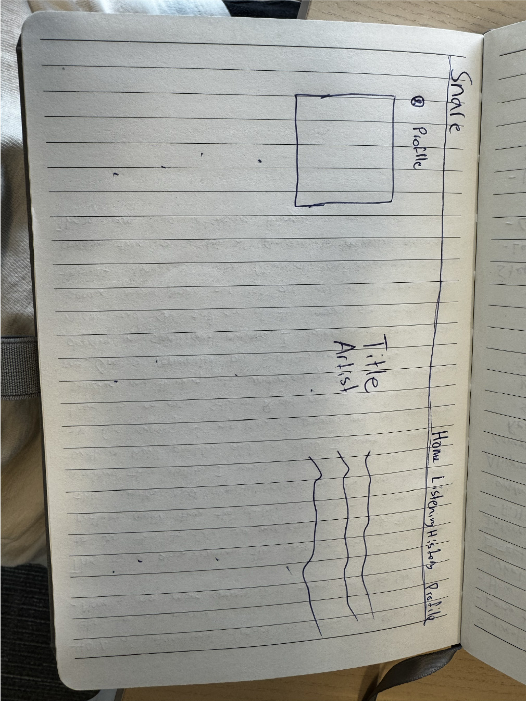

# startup

## Elevator Pitch
In a day with so much music being released and so many different options to listen, how do you discover your music identity? I am going to build Snare, a music discovery platform where you share your music listening history and reviews with your friends.

### Key features & Technologies:
1. I will use HTML to outline the structure with a recently listened to page, a feed with your friends, a login/sign up page, and a profile. 
2. I will use CSS to make this super cool and pleasing for people to use stylistically.
3. I will use react to help me make components dynamic and load data for listens, and other stuff as such. 
4. I will use a database for the auth, and all of the storage for listening data, friend relationships, and posts
5. Websocket: I will use the websocket to make it so that when a friend posts a review it will update my feed. 

### Mockup:

##HTML Deliverable
- [] HTML Pages: There are pages for dms, profile, samples, signin, and my home page
- [] Ptoper HTML element usage: I used the header and nav bar on all pages, body to put the main content in, divs to separate concerns, tables mostly for structure, and footers. 
- [] Links: I linked my github page, and all the html pages together
- [] Text: I used text to show different info
- [] 3rd Party Placeholders: I am going to pull the listening history from apple music and new releases
- [] Images: I have album covers and profile placeholders
- [] Login Placeholder: it is in the top right on the homepage
- [] DB data placeholder: all the album covers and reviews will come from the database
- [] Websocket placeholder: This is in the messages

## CSS Deliverable
- Went through and styled each page. 
- Overall: I changed the background to gray and the text to white and made all the links to other pages blue and used tailwind.css
- Homepage: I used a flex class to style the new releases and the revies. Added my name and github to the footer
- Sign in: I implemented a simple sign in page and styled the boxes to be white and the sign in button to be blue
- Samples: I just set all of them to be centered and rounded the photos to give it a cool prestine look.
- Dms: I put the dm in a flex container and added a background of blue a so you could see that you could click anywhere to go into the message
- Profile: Profile has two flexboxes one horizontal and one vertical for the top followers and listening history buttons and the other for the users reviews

## React P1 deliverable
- For React P1 I went through and edited my structure just a bit and started using .jsx files. I have been using Tailwind so for my css I didn't have to change much other than switchign the version I was using in my postcss.confic.js file and the input .css file. Other than that I switched the deploy file to deploy react instead of files. 